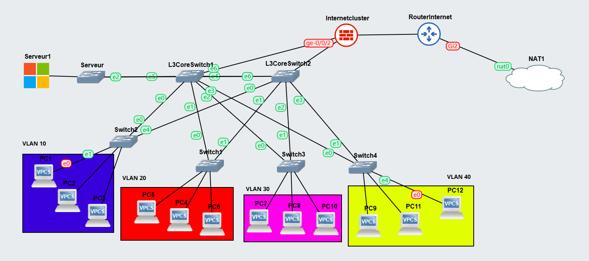

# Compte-rendu final - Projet TechNova

## Rappel du contexte
TechNova (Siege + Paris) a besoin d'un reseau segmente, securise et administrable.
La maquette GNS3 deployee couvre la segmentation VLAN, le routage inter-VLAN, la securite perimetrique, l'acces Internet et l'automatisation d'exploitation.

## Reponse aux besoins

Il manque le deuxième routeur au niveau du NAT, nous ne l'avions pas encore implémenté au moment du screen et je n'ai pas eu la présence d'esprit d'en reprendre vendredi

1. Segmentation reseau
- VLANs actifs : 10, 20, 30, 40 et 50 (serveurs).
- Cloisonnement logique des departements.

2. Routage inter-VLAN et disponibilite
- Routage L3 actif sur les switches de distribution.
- HSRP deploye pour la haute disponibilite des passerelles.
- Routage par defaut operationnel vers le perimetre firewall/Internet.
- OSPF (aire 0) active pour la diffusion dynamique des routes entre equipements de coeur.

3. Services reseau
- DHCP par VLAN.
- DNS interne pour la resolution locale.
- Le DHCP automatise l'attribution IP des postes et simplifie l'administration.
- Le DNS permet la resolution de noms interne et l'acces plus simple aux services.

4. Securite
- Firewall dedie FW-TECHNOVA avec ZBFW stateful.
- NAT/PAT actif sur le routeur Internet.
- ACL inter-VLAN appliquees pour controler les flux Est-Ouest.
- Le firewall protege le reseau interne en filtrant les flux entrants/sortants et en bloquant par defaut les connexions non sollicitees depuis l'exterieur.

5. Exploitation et automatisation
- Sauvegardes de configuration automatisees.
- Monitoring de connectivite automatise (script Bash).

## Devis
Devis basé sur le PDF Devis NovaTech, avec ajout d'un 2e routeur Internet pour la redondance WAN.

### 1) Materiel reseau et securite
| Equipement | Modèle | Quantité | Prix unitaire | Total |
|---|---|---:|---:|---:|
| Switches de coeur L3 (routage inter-VLAN) | Cisco Catalyst 9300X-24Y (48p 10G + 2x 100G) | 2 | 1 100 EUR | 2 200 EUR |
| Switches d'acces L2 (departements + serveurs) | Cisco Catalyst 9200 (24p 1G RJ45 PoE+) | 5 | 350 EUR | 1 750 EUR |
| Pare-feu (FW-TECHNOVA) | Cisco ASA 5500-X (5525-X, 6x 1G Eth) | 1 | 650 EUR | 650 EUR |
| Routeur Internet principal | Cisco ISR 4431 (3x GigaEth WAN, 1x GigaEth LAN) | 1 | 300 EUR | 300 EUR |
| Routeur Internet secondaire (redondance) | Cisco ISR 4431 (3x GigaEth WAN, 1x GigaEth LAN) | 1 | 300 EUR | 300 EUR |
| **Sous-total materiel reseau et securite** |  |  |  | **5 200 EUR** |

### 2) Serveur et infrastructure
| Composant | Modèle/Détail | Quantité | Prix unitaire | Total |
|---|---|---:|---:|---:|
| Serveur entreprise standard | Dell PowerEdge R750 (2x Xeon Silver 4314, 512 GB RAM, 4x 1 TB SSD NVMe) | 1 | 2 200 EUR | 2 200 EUR |
| Baie informatique (rack 12U/15U) | APC Netshelter SX 18U 600mm (avec PDU et cooling) | 1 | 450 EUR | 450 EUR |
| Onduleur UPS | APC Smart-UPS SRT 6000VA (6kW, durée : ~15 min à charge complète) | 1 | 850 EUR | 850 EUR |
| **Sous-total serveur et infrastructure** |  |  |  | **3 500 EUR** |

### 3) Cablage et connectique
| Composant | Modèle/Détail | Quantité | Prix unitaire | Total |
|---|---|---:|---:|---:|
| Bobines Cat6 UTP (305 m) | Nexans Cat6 UTP solide 0.58mm (305 m/bobine) | 4 | 130 EUR | 520 EUR |
| Modules SFP+ 10G | Cisco SFP-10G-LR (SMF, 10km) | 12 | 25 EUR | 300 EUR |
| Cables DAC SFP+ | SFP+ Direct Attach Copper 1m (actif) | 4 | 30 EUR | 120 EUR |
| Prises murales + cordons de brassage | Keystone Cat6A RJ45 + cordons 0.5m tressés | 60 packs | 8 EUR | 480 EUR |
| **Sous-total cablage et connectique** |  |  |  | **1 420 EUR** |

### 4) Recapitulatif budget
| Poste | Montant |
|---|---:|
| Materiel reseau et securite | 5 200 EUR |
| Serveur et infrastructure | 3 500 EUR |
| Cablage et connectique | 1 420 EUR |
| **Total general revise** | **10 120 EUR** |

Hypothese de capacite : simulation pour 60 postes.

## Plan d'addressage

Adressage VLAN retenu dans la maquette finale :

| VLAN | Nom | Département | Site | Réseau | GW (HSRP VIP) | SVI L3SW1 | SVI L3SW2 |
|------|-----|-------------|------|--------|---------------|-----------|-----------|
| 10 | RD | R&D | Siege | 172.16.10.0/24 | 172.16.10.1 | 172.16.10.2 | 172.16.10.3 |
| 20 | RH | Ressources Humaines | Siege | 172.16.20.0/24 | 172.16.20.1 | 172.16.20.2 | 172.16.20.3 |
| 30 | FINANCE | Finance & Comptabilite | Siege | 172.16.30.0/24 | 172.16.30.1 | 172.16.30.2 | 172.16.30.3 |
| 40 | JURIDIQUE | Juridique | Siege | 172.16.40.0/24 | 172.16.40.1 | 172.16.40.2 | 172.16.40.3 |
| 50 | SERVEURS | Serveurs internes | Siege | 192.168.50.0/24 | 192.168.50.1 | 192.168.50.2 | 192.168.50.3 |

### ACL

- ACL inter-VLAN sur switches L3 pour controler les flux internes.
- Flux autorises : VLAN 10/20/30/40 vers VLAN 50 (DNS 53, DHCP 67/68, SMB 445, HTTP 80).
- Flux inter-departements (10/20/30/40 entre eux) bloques par defaut.
- Sortie Internet autorisee via FW-TECHNOVA (ZBFW) et NAT/PAT.

### Liaisons inter-equipements observees
- RouterInternet <-> FW : 10.0.14.0/30
- FW <-> Switch L3 principal : 10.0.15.0/30
- Inter-switch L3 : 10.0.16.0/30
- FW <-> Switch L3 secondaire : 10.0.17.0/30

## Points cles
- Architecture 3 couches claire, adaptee a un contexte entreprise.
- Segmentations et passerelles redondantes en place pour la continuite de service.
- Routage dynamique OSPF active, avec propagation des routes internes et de la route par defaut.
- Perimetre securite coherent avec un firewall dedie et une sortie Internet maitrisee.
- Exploitation outillee (backup + monitoring) pour faciliter l'administration quotidienne.
- Budget detaille et argumente, incluant la redondance WAN par double routeur Internet.

Scripts d'automatisation :
- Sauvegarde automatisée des configurations reseau avec journalisation des executions.
- Supervision automatisée de la connectivite (tests periodiques et suivi de disponibilite).

Conclusion : la maquette finale repond aux objectifs fonctionnels du projet et presente une base solide, evolutive et defendable en soutenance.
